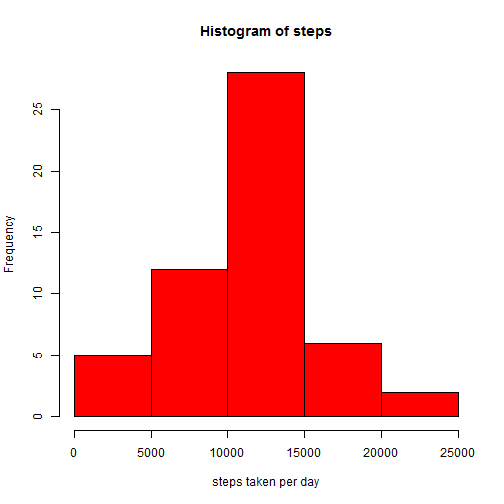
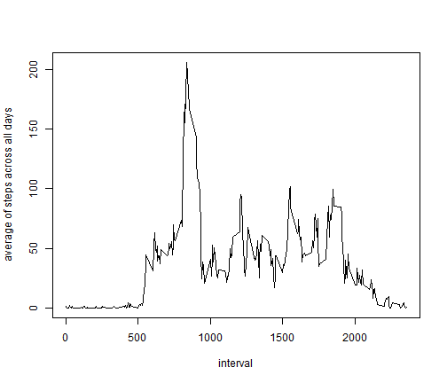
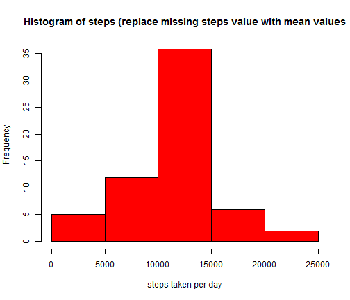
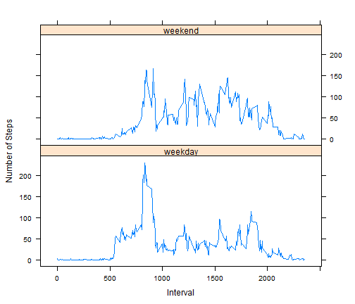

---
title: "Reproducible Research: Peer Assessment 1"
output: 
  html_document:
        keep_md: true
---
## Loading and preprocessing the data


```r
setwd("C:/Users/a0g331/Desktop/R4/5_ReproResearch")
library(knitr)
##knit2html("PA1_template.RMD")
```

```r
 activityRawData<- read.csv("C:/Users/a0g331/Desktop/R4/5_ReproResearch/data/activity.csv")
```
## Question 1: What is mean total number of steps taken per day?  
              (For this part of the assignment, you can ignore the missing values in the dataset.)
 
 1.1  Make a histogram of the total number of steps taken each day Calulate the sum of step by date and plot histogram.

```r
        NoMissingData<- na.omit(activityRawData)
        StepSumByDate<- aggregate(NoMissingData$step, by=list(Category=NoMissingData$date), FUN="sum") 
        with(StepSumByDate, hist(x, col = "red", xlab="steps taken per day", main="Histogram of steps")) 
```

 

 1.2 Calculate and report the mean and median total number of steps taken per day
            
  'mean of total number of steps taken per day' means taking the sum of the steps per day, two months of that data and then calculate mean value.

```r
       mean(StepSumByDate$x)
```

```
## [1] 10766.19
```
  median of total number of steps taken per day

```r
       median(StepSumByDate$x)
```

```
## [1] 10765
```

## Question 2: What is the average daily activity pattern?
2.1  Make a time series plot (i.e. type = "l") of the 5-minute interval (x-axis) and the average number 
     of steps taken, averaged across all days (y-axis)

```r
StepAveByInterval<- aggregate(NoMissingData$step, by=list(Category=NoMissingData$interval), FUN=mean) 
```

```r
with(StepAveByInterval, plot(Category, x, type = "l", xlab="interval", ylab="average of steps across all days")) 
```

 

2.2	Which 5-minute interval, on average across all the days in the dataset, contains the maximum number of steps?

  The interval number is: 

```r
  subset(StepAveByInterval,StepAveByInterval$x==max(StepAveByInterval$x))$Category
```

```
## [1] 835
```

## Question 3: Imputing missing values
Note that there are a number of days/intervals where there are missing values (coded as NA). The presence of missing days may introduce bias into some calculations or summaries of the data.

3.1  Calculate and report the total number of missing values in the dataset (i.e. the total number of rows with NAs)

```r
    nrow(activityRawData) - nrow(na.omit(activityRawData))
```

```
## [1] 2304
```
3.2	Devise a strategy for filling in all of the missing values in the dataset. The strategy does not need to be sophisticated. For example, you could use the mean/median for that day, or the mean for that 5-minute interval, etc.

   I used the mean for that 5-minute interval and convert the mean value to integer, then replace NA steps value.
   
   Step 1: take records without missing values to calculate mean per 5-minute interval across all days.

```r
   NoMissingData<- na.omit(activityRawData)
   StepMeanByInterval<- aggregate(NoMissingData$step, by=list(Category=NoMissingData$interval), FUN="mean") 
   names(StepMeanByInterval)[match('Category',names(StepMeanByInterval))] <- "interval"
   names(StepMeanByInterval)[match('x',names(StepMeanByInterval))] <- "stepMean"
```
 
   Step 2: merge step 1 data with raw data by interval number. Get all records from raw data.          

```r
   RawDataWithMean<- merge(activityRawData, StepMeanByInterval, by='interval',all.x = T, sort='T')
```
3.3  Create a new dataset that is equal to the original dataset but with the missing data filled in.

```r
   MissingSteps<- RawDataWithMean[which(is.na(RawDataWithMean$steps)),] 
   MissingSteps$steps <-MissingSteps$stepMean 
   NOTMissingSteps<- RawDataWithMean[which(!is.na(RawDataWithMean$steps)),] 
   NAfilled<-rbind(MissingSteps, NOTMissingSteps)
   NAFilledSorted<- NAfilled[order(NAfilled$date,NAfilled$interval),]   
   NAFilledData<-data.frame(steps=NAFilledSorted$steps, date=NAFilledSorted$date,
                            interval=NAFilledSorted$interval) 
```
3.4	Make a histogram of the total number of steps taken each day and Calculate and report the mean and median total number of steps taken per day. Do these values differ from the estimates from the first part of the assignment? What is the impact of imputing missing data on the estimates of the total daily number of steps?
  Step 1: histogram with mean value filled in

```r
        NAFilledDataStepSumByDate<- aggregate(NAFilledData$step, by=list(Category=NAFilledData$date), FUN="sum") 
        with(NAFilledDataStepSumByDate, hist(x, col = "red", xlab="steps taken per day", main="Histogram of steps (replace missing steps value with mean values")) 
```

 
 
step 2: Calculate and report the mean and median total number of steps taken per day and compare it with mean value from raw data.
 
   Mean value comparision:

```r
      mean(NAFilledDataStepSumByDate$x) 
```

```
## [1] 10766.19
```

```r
      mean(StepSumByDate$x)
```

```
## [1] 10766.19
```
  Median value comparision:

```r
      median(NAFilledDataStepSumByDate$x) 
```

```
## [1] 10766.19
```

```r
      median(StepSumByDate$x)
```

```
## [1] 10765
```
 
## Question 4: Is there differences in activity patterns between weekdays and weekends?

 For this part the weekdays() function may be of some help here. Use the dataset with the filled-in missing values for this part.
 
4.1  Create a new factor variable in the dataset with two levels - "weekday" and "weekend" indicating whether a given date is a weekday or weekend day.

The factor varialber is called weekendOrnot within WeekdayData data frame.

```r
    WeekdayData<-data.frame()
    DayofWeek<-weekdays(as.Date(NAFilledData$date,"%Y-%m-%d" ))   
    WeekdayData<- cbind(NAFilledData,DayofWeek)   
    WeekdayData$weekendOrnot= 
    factor(ifelse(WeekdayData$DayofWeek%in% c("Saturday","Sunday"),"weekend","weekday"))
```
4.2 	Make a panel plot containing a time series plot (i.e. type = "l") of the 5-minute interval (x-axis) and the average number of steps taken, averaged across all weekday days or weekend days (y-axis). The plot should look something like the following, which was creating using simulated data:

 Calculate the data for the plot

```r
StepAveByIntervalWeekdayData<- aggregate(WeekdayData$step,
                                        by=list(interval=WeekdayData$interval, 
                                                weekendOrnot=WeekdayData$weekendOrnot),
                                        FUN=mean) 
```
Plot for average steps by interval, compare for weekend and weekday

```r
library(lattice) 
 xyplot(StepAveByIntervalWeekdayData$x ~ StepAveByIntervalWeekdayData$interval|
        StepAveByIntervalWeekdayData$weekendOrnot, layout = c(1, 2), type = "l",
        xlab="Interval", ylab="Number of Steps")
```

 


